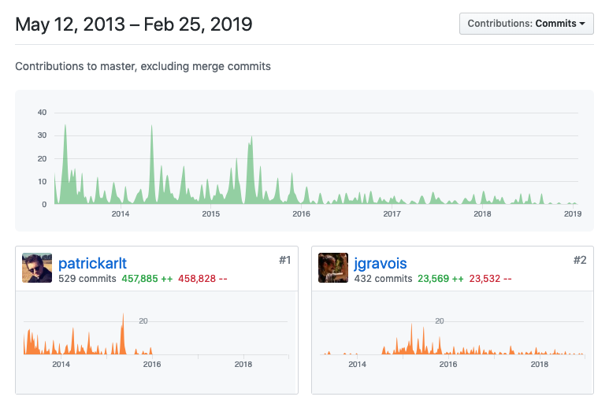

<!--

to do:
remind folks that leaflet is in maintenance mode
get code snippets and iframes to display side by side
replace labeling and driving directions demos with
  (improved?) VRP demo?
  Leaflet.VectorGrid demo?
add section to explain passing through an optional function context
add section to highlight other things we've been working on like arcgis-rest-request

 -->

<!-- .slide: data-background="../../template/img/2019/devsummit/bg-1.png" -->

<!--div style="margin: auto; padding-top: 50px; padding-bottom: 50px; width: 80%; background: rgba(30,30,30,0.9)"/-->

<h1 style="text-align: left; font-size: 80px;"><i>Building Apps with </i> <b>Esri Leaflet</b></h1>
    <p style="text-align: left; font-size: 1.5em;"><a href="https://github.com/jgravois">@jgravois</a></p>
    <p style="text-align: left; font-size: 1.5em;">slides: <a href="https://bit.ly/2C6bWdo"><code>https://bit.ly/2C6bWdo</code></a>

---

<!-- .slide: data-background="../../template/img/2019/devsummit/bg-2.png" -->

## Agenda

1. Fundamentals
2. Jungle boat cruise
3. Demos
4. State of the Union

---

<!-- .slide: data-background="../../template/img/2019/devsummit/bg-3.png" -->

## Disclaimer*

---

<!-- .slide: data-background="../../template/img/2019/devsummit/bg-4.png" -->

### Its a group effort

* open source, community supported
* no roadmap, no product lifecycle

Note:
  contributions from
  USGS, State Dept, Netflix, Stanford University, City of Philadelphia, Utah AGRC

  apps from
  Stanford University, Forest Service, Ride Amigos, Mapillary, Storymaps team...

---

<!-- .slide: data-background="../../template/img/2019/devsummit/bg-5.png" -->

## what is [`Leaflet`](https://leafletjs.com)?

an open-source JavaScript library<br>for mobile-friendly interactive maps

small, stable, **popular**

Note:
   beginner friendly (kinda)
     JS code isn't complex, managing dependencies can be

   Washington Post, Craigslist, GitHub, Flickr, (Facebook?)

---

<!-- .slide: data-background="../../template/img/2019/devsummit/bg-6.png" -->

## designed for web developers

<div class="twos">
  <div class="snippet">
  <pre><code class="lang-js hljs javascript">
  var map = L.map("mapDiv").setView([-45, -120], 10);


  // do the same thing without method chaining

  var map = L.map("mapDiv");
  map.setView([45, -120], 10)

</code></pre>
  </div>
  <div class="snippet-preview">
    <iframe id="frame-2d-parallel" data-src="./snippets/map.html"></iframe>
  </div>
</div>

coordinates are passed in Y,X order

Note:
  WGS84 projection is assumed. map is web mercator
</aside>

---

<!-- .slide: data-background="../../template/img/2019/devsummit/bg-2.png" -->

## How small _is_ Leaflet?


## [`36kb`](https://unpkg.com/leaflet@1.4.0/dist/leaflet.js)!

---

<!-- .slide: data-background="../../template/img/2019/devsummit/bg-3.png" -->

### so small it doesn't help<br>you fetch .geojson files

<div class="twos">
  <div class="snippet">
  <pre><code class="lang-js hljs javascript">

  // leaflet.css
  // leaflet.js

  // then a plugin
  // <script src="https://unpkg.com/leaflet-ajax@2.1.0"></script>

  L.GeoJson.ajax("/data/giraffes.geojson").addTo(map);

</code></pre>
  </div>
  <div class="snippet-preview">
    <!-- show a button and fetch GeoJSON -->
    <iframe id="frame-2d-parallel" data-src="./snippets/ajax.html"></iframe>
  </div>
</div>

an extra plugin *just to load a file*!

Note:
  no wrapper for xmlHttpRequest

---

<!-- .slide: data-background="../../template/img/2019/devsummit/bg-4.png" -->

### luckily `Leaflet` has a *big* [plugin](https://leafletjs.com/plugins.html) community


---

<!-- .slide: data-background="../../template/img/2019/devsummit/bg-5.png" -->

### [`Esri Leaflet`](https://esri.github.io/esri-leaflet) is a plugin
to make working with the most<br>popular ArcGIS Services a **pleasure**

---

<!-- .slide: data-background="../../template/img/2019/devsummit/bg-4.png" -->

### 63 [contributors](https://github.com/Esri/esri-leaflet/graphs/contributors)!

---

<!-- .slide: data-background="../../template/img/2019/devsummit/bg-6.png" -->

### 1000+ 🌟s!


---

<!-- .slide: data-background="../../template/img/2019/devsummit/bg-6.png" -->

## Goals

1. provide sensible defaults
2. mimic Leaflet's own conventions
2. keep it simple

---

<!-- .slide: data-background="../../template/img/2019/devsummit/bg-2.png" -->

## Lets take a tour!

---

<!-- .slide: data-background="../../template/img/2019/devsummit/bg-3.png" -->

## [`L.tileLayer`](http://leafletjs.com/reference-1.0.3.html#tilelayer)

<div class="twos">
  <div class="snippet">
  <pre><code class="lang-js hljs javascript">

  // /lib/leaflet.css
  // /lib/leaflet.js

  var url = '//{s}.tile.osm.org/{z}/{x}/{y}.png';

  var tiled = L.tileLayer(url, {
    attribution: '&copy; <a href="http://osm.org/copyright">
    OpenStreetMap</a> contributors'
  })

  tiled.addTo(map);

</code></pre>
  </div>
  <div class="snippet-preview">
    <iframe id="frame-2d-parallel" data-src="./snippets/map.html"></iframe>
  </div>
</div>

requires manual attribution and knowledge of tiling scheme

---

<!-- .slide: data-background="../../template/img/2019/devsummit/bg-4.png" -->

## [`L.esri.basemapLayer`](http://esri.github.io/esri-leaflet/api-reference/layers/basemap-layer.html)

<div class="twos">
  <div class="snippet">
  <pre><code class="lang-js hljs javascript">

  // /lib/leaflet.css
  // /lib/leaflet.js

  // /lib/esri-leaflet.js

  L.esri.basemapLayer('Streets').addTo(map);

  // or
  const options = { minZoom: 3 }

  L.esri.basemapLayer('Streets', options).addTo(map);

</code></pre>
  </div>
  <div class="snippet-preview">
    <iframe id="frame-2d-parallel" data-src="./snippets/e-map.html"></iframe>
  </div>
</div>

map credits update on pan/zoom<br>
`L.TileLayer` properties, methods and events are inherited

---

<!-- .slide: data-background="../../template/img/2019/devsummit/bg-5.png" -->

`<segway>`

## some `Leaflet` fundamentals

`</segway>`

---

<!-- .slide: data-background="../../template/img/2019/devsummit/bg-6.png" -->

## [`L.GeoJSON`]()

<div class="twos">
  <div class="snippet">
  <pre><code class="lang-js hljs javascript">
const data = {
  "type": "Feature",
  "geometry": {
    "type": "Point",
    "coordinates": [125.6, 10.1]
  },
  "properties": { "name": "Dinagat Islands" }
}

const islands = L.geoJSON(data)

islands.bindPopup(layer =>
  layer.feature.properties.name
).addTo(map);

</code></pre>
  </div>
  <div class="snippet-preview">
    <iframe id="frame-2d-parallel" data-src="./snippets/dinagat.html"></iframe>
  </div>
</div>

<aside class="notes">

</aside>

---

<!-- .slide: data-background="../../template/img/2019/devsummit/bg-2.png" -->

## `Esri Leaflet`
### builds on the fundamentals

---

<!-- .slide: data-background="../../template/img/2019/devsummit/bg-3.png" -->

## [`L.esri.FeatureLayer`]()

<div class="twos">
  <div class="snippet">
  <pre><code class="lang-js hljs javascript">
const buses = L.esri.featureLayer({
  url: '../services/Buses/MapServer/0',
  where: "direction='North'"
})

buses.bindPopup(layer =>
  layer.feature.properties.stop_name;
);

buses.addTo(map);

</code></pre>
  </div>
  <div class="snippet-preview">
    <iframe id="frame-2d-parallel" data-src="./snippets/fl-filtered.html"></iframe>
  </div>
</div>

spatial/sql filtering, popups bound when feature is clicked

---

<!-- .slide: data-background="../../template/img/2019/devsummit/bg-4.png" -->

## [`L.esri.tiledMapLayer`]()

<div class="twos">
  <div class="snippet-preview">
    <iframe id="frame-2d-parallel" data-src="./snippets/tiled.html"></iframe>
  </div>
</div>

```js
L.esri.tiledMapLayer({ url: '//server.com/Cooked/MapServer' });
```

---

<!-- .slide: data-background="../../template/img/2019/devsummit/bg-5.png" -->

## [`L.esri.dynamicMapLayer`]()

<div class="twos">
  <div class="snippet">
  <pre><code class="lang-js hljs javascript">

const dynLayer = L.esri.dynamicMapLayer({
  url: '../services/SampleWorldCities/MapServer',
  layerDefs: { 0:'POP_RANK < 2' }
}).addTo(map);

dynLayer.bindPopup((error, collection) =>
  collection.features[0].properties.NAME;
);
</code></pre>
  </div>
  <div class="snippet-preview">
    <iframe id="frame-2d-parallel" data-src="./snippets/dynamic-filtered.html"></iframe>
  </div>
</div>

---

<!-- .slide: data-background="../../template/img/2019/devsummit/bg-6.png" -->

## [`L.esri.imageMapLayer`]()

<div class="twos">
  <div class="snippet">
  <pre><code class="lang-js hljs javascript">
L.esri.imageMapLayer({
  url: "//landsat.arcgis.com/.../ImageServer/",
  bandIds: [4,3,2],
  from: new Date('2000'),
  to: new Date('2000')
}).addTo(map);

// or
const renderingRule = { "rasterFunction": 'NDVI Colorized' };

L.esri.imageMapLayer({
  url: landsatUrl,
  renderingRule
}).addTo(map);

</code></pre>
  </div>
  <div class="snippet-preview">
    <iframe id="frame-2d-parallel" data-src="./snippets/rasterFunction.html"></iframe>
  </div>
</div>

custom raster functions are supported

---

## What about `Tasks`?

```js
L.esri.query()

L.esri.identifyFeatures()

// plugin
L.esri.Geocoding.geocode()
```

---

## [`L.esri.query()`](http://esri.github.io/esri-leaflet/api-reference/tasks/query.html)

[👧 JS](./snippets/query-task.html) / [👵 JS](./snippets/query-task-old.html)

---

and what is _"Accepts an optional function context"_?

[👧 JS](./snippets/query-task.html) / [👵 JS](./snippets/query-task-old.html)

---

* intuitive way to chain API parameters together
* callback exposes both a raw and massaged response

---


<!-- .slide: data-background="../../template/img/2019/devsummit/bg-2.png" -->

### more `Esri Leaflet` [plugins](http://esri.github.io/esri-leaflet/plugins)

* address [search](http://esri.github.io/esri-leaflet/examples/geocoding-control.html)
* server side [renderers](http://esri.github.io/esri-leaflet/examples/renderers-plugin.html)
* [geoprocessing](http://esri.github.io/esri-leaflet/examples/gp-plugin.html) services

---

<!-- .slide: data-background="../../template/img/2019/devsummit/bg-3.png" -->

### more `Esri Leaflet` [plugins](http://esri.github.io/esri-leaflet/plugins)

* driving [directions](http://github.com/jgravois/lrm-esri)*
* [Stream Layers](http://esri.github.io/esri-leaflet/examples/stream-plugin.html) from GeoEvent
* [web maps](http://esri.github.io/esri-leaflet/examples/webmap.html?id=13750b8b548d48bfa99a9731f2a93ba0)
* Legends

---

<!-- .slide: data-background="../../template/img/2019/devsummit/bg-6.png" -->

## fixes / improvements

* [@Biboba](https://github.com/Biboba) added methods to add/update features in bulk
* [@pmacMaps](https://github.com/pmacMaps) added `ImageryFirefly` and `Physical` basemaps

---

<!-- .slide: data-background="../../template/img/2019/devsummit/bg-6.png" -->

* [@appleshowc](https://github.com/appleshowc) added a `zIndex` constructor option

to `dynamicMapLayer` and `imageMapLayer`

* [@dangowans](https://github.com/dangowans) added proxy support to `ImageMapLayer`

---

<!-- .slide: data-background="../../template/img/2019/devsummit/bg-6.png" -->

## what now?



---

<!-- .slide: data-background="../../template/img/2019/devsummit/bg-2.png" -->

## [Leaflet](https://leafletjs.com) stable at [`v1.4.0`](https://github.com/Leaflet/Leaflet/blob/master/CHANGELOG.md#140-2018-12-30)

---


<!-- .slide: data-background="../../template/img/2019/devsummit/bg-3.png" -->

## Esri Leaflet is mature too.

* ~~3D~~
* ~~rotation~~
* ~~WebGL~~

---

<!-- .slide: data-background="../../template/img/2019/devsummit/bg-4.png" -->

[`esri-leaflet-vector`](https://github.com/esri/esri-leaflet-vector) is **not** mature at all!

---

<!-- .slide: data-background="../../template/img/2019/devsummit/bg-5.png" -->

* [webpack](https://github.com/Esri/esri-leaflet-webpack-example)
* [rollup](https://github.com/Esri/esri-leaflet-bundler)
* [browserify](https://github.com/Esri/esri-leaflet-browserify-example)

---

<!-- .slide: data-background="../../template/img/2019/devsummit/bg-6.png" -->

check out [`esri-loader`](https://github.com/Esri/esri-loader) and [`arcgis-webpack-plugin`](https://github.com/Esri/arcgis-webpack-plugin) too

---

<!-- .slide: data-background="../../template/img/2019/devsummit/bg-2.png" -->

and **please** fill out a session survey

1. download the Esri Events App
2. select Dev Summit
3. search for "Leaflet"
4. leave feedback!

---

<!-- .slide: data-background="../../template/img/2019/devsummit/bg-3.png" -->

idea, question, issue, or success story?

@geogangster / [john@esri.com](mailto:john@esri.com)

slides: [`http://bit.ly/2oQCl7G`](slides: `http://bit.ly/2oQCl7G`)

---

<!-- .slide: data-background="../../template/img/2019/devsummit/bg-rating.png" -->

---

<!-- .slide: data-background="../../template/img/2019/devsummit/bg-esri.png" -->
